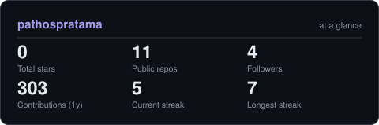
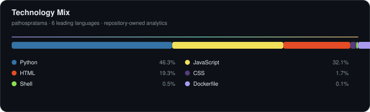

<!-- ═══════════════════════════════════════════════════════════════
     PATHOS KRATOS — GITHUB PROFILE README
     Edition : Curated v6 · Systemic · Animated · Self-Hosted · Bilingual
     Sections: hero · focus · projects · stack · signals · self-hosted
               analytics · contribution snake · system · direction · connect · footer
     Palette : #AA9BEF (lavender) · #7EE7C7 (mint) · #F5C77E (amber)
     ═══════════════════════════════════════════════════════════════ -->

  

   

  <picture>
    <source media="(prefers-color-scheme: dark)" srcset="assets/banner-dark.v9.svg">
    <source media="(prefers-color-scheme: light)" srcset="assets/banner-light.v9.svg">
    
  </picture>

    

  

    

  
  
  
  

   
  <b>🇬🇧</b> Indonesia-based · Software Engineering · Systems · AI · Interactive Technology 
  <b>🇮🇩</b> Berbasis di Indonesia · Rekayasa Perangkat Lunak · Sistem · AI · Teknologi Interaktif

 

<!-- 01 FOCUS -->

 

<table>
<tr><th>#</th><th>Domain</th><th>Focus</th><th>Stack / Output</th></tr>
<tr><td align="center"><code>01</code></td><td><b>🧠 Full-Stack</b></td><td>Application engineering</td><td>Next.js · React · TypeScript · Python</td></tr>
<tr><td align="center"><code>02</code></td><td><b>⚙️ Backend</b></td><td>Services and APIs</td><td>FastAPI · Flask · PostgreSQL · Supabase</td></tr>
<tr><td align="center"><code>03</code></td><td><b>🤖 AI</b></td><td>Automation and intelligent workflows</td><td>Agents · Models · Computer Vision</td></tr>
<tr><td align="center"><code>04</code></td><td><b>🛰️ Realtime / IoT</b></td><td>Connected devices and live data</td><td>WebSocket · ESP32 · Bluetooth · Wi-Fi</td></tr>
<tr><td align="center"><code>05</code></td><td><b>🎨 3D / Interactive</b></td><td>Interactive visual systems</td><td>Three.js · R3F · Blender</td></tr>
<tr><td align="center"><code>06</code></td><td><b>☁️ Delivery</b></td><td>Deploy and automate</td><td>Docker · GitHub Actions · Vercel · AWS</td></tr>
</table>

 

<!-- 02 PROJECTS -->

 

<table>
<tr>
<td width="50%" valign="top"><h3>⚖️ Jurivia</h3>
<code>Next.js</code> · <code>FastAPI</code> · <code>PostgreSQL</code> · <code>Supabase</code>

Legal-tech platform for lawyer profiles, scheduling, messaging, authentication, and backend services.

<b>🇮🇩</b> Platform legal-tech untuk profil advokat, jadwal, komunikasi, autentikasi, dan service backend.
</td>
<td width="50%" valign="top"><h3>🤖 makistoAIagentService</h3>
<code>Python</code> · <code>AI Agents</code> · <code>ML</code> · <code>Streaming</code>

Modular AI agent service with data providers, decision engines, models, orchestration, streaming, and task execution.

<b>🇮🇩</b> Service agen AI modular untuk orkestrasi workflow backend.
</td>
</tr>
<tr>
<td width="50%" valign="top"><h3>📡 makistoTradeAPI</h3>
<code>Python</code> · <code>API Gateway</code> · <code>Modular Backend</code>

Structured API gateway with modular API and core layers for cryptocurrency-related services.

<b>🇮🇩</b> Gateway API dengan arsitektur backend modular.
</td>
<td width="50%" valign="top"><h3>🧰 ToolsBackend</h3>
<code>Python</code> · <code>FastAPI</code> · <code>REST</code> · <code>PDF</code>

Backend tooling platform for documentation, PDF utilities, and extensible API workflows.

<b>🇮🇩</b> Backend untuk tooling aplikasi, dokumentasi, utilitas PDF, dan workflow API.
</td>
</tr>
<tr>
<td width="50%" valign="top"><h3>📸 Photobooth</h3>
<code>Python</code> · <code>FastAPI</code> · <code>Computer Vision</code> · <code>WebSocket</code>

Realtime image-processing workflow with background removal, filters, effects, REST APIs, and WebSocket communication.

<b>🇮🇩</b> Sistem photobooth realtime dengan pemrosesan gambar dan komunikasi live.
</td>
<td width="50%" valign="top"><h3>🛰️ ESP32-IoT-System</h3>
<code>ESP32</code> · <code>Bluetooth</code> · <code>Wi-Fi</code> · <code>WebSocket</code>

Connected-device system with provisioning, Wi-Fi configuration, realtime communication, and server-driven interaction.

<b>🇮🇩</b> Sistem IoT untuk provisioning, konfigurasi, realtime, dan kontrol perangkat.
</td>
</tr>
</table>

 

<!-- 03 STACK -->

 

<table>
<tr>
<td width="25%" align="center"><h4>🧠 Languages</h4> Python · TypeScript · JavaScript · SQL</td>
<td width="25%" align="center"><h4>🎨 Frontend</h4> React · Next.js · Tailwind · Node.js</td>
<td width="25%" align="center"><h4>⚙️ Backend / Data</h4> FastAPI · Flask · PostgreSQL · Supabase</td>
<td width="25%" align="center"><h4>☁️ Infra / 3D</h4> Docker · AWS · Vercel · GitHub · Three.js · Blender</td>
</tr>
</table>

 

<!-- 04 SIGNALS -->

 

<table>
<tr>
<td width="50%" align="center"><picture><source media="(prefers-color-scheme: dark)" srcset="assets/radar-dark.svg"><source media="(prefers-color-scheme: light)" srcset="assets/radar-light.svg"></picture> Engineering Skill Radar · Radar Kompetensi</td>
<td width="50%" align="center"><picture><source media="(prefers-color-scheme: dark)" srcset="assets/radar-langs-dark.svg"><source media="(prefers-color-scheme: light)" srcset="assets/radar-langs-light.svg"></picture> Technology Radar · Radar Teknologi</td>
</tr>
</table>

 

<!-- 05 SELF-HOSTED -->

 

  Repository-owned SVGs · Python generators · GitHub Actions
    
  <picture>
    <source media="(prefers-color-scheme: dark)" srcset="assets/card-stats-dark.svg">
    <source media="(prefers-color-scheme: light)" srcset="assets/card-stats-light.svg">
    
  </picture>
    
  

 

<!-- 06 ANALYTICS -->

 

  Live contribution movement · activity is treated as the system's data stream
    
  

 

  <picture>
    <source media="(prefers-color-scheme: dark)" srcset="https://raw.githubusercontent.com/pathospratama/pathospratama/output/github-contribution-snake-dark.svg">
    <source media="(prefers-color-scheme: light)" srcset="https://raw.githubusercontent.com/pathospratama/pathospratama/output/github-contribution-snake-light.svg">
    
  </picture>

 

<table>
<tr>
  <td width="25%" align="center"><code>HEAD</code> find active contribution</td>
  <td width="25%" align="center"><code>BODY</code> follow traversal path</td>
  <td width="25%" align="center"><code>BITE</code> consume active cell</td>
  <td width="25%" align="center"><code>LOOP</code> restart from the grid edge</td>
</tr>
</table>

 

<code>PATHOS // SNAKE.PROTOCOL</code> · Lavender snake · GitHub contribution colors · Dark/light aware

 

<!-- 07 SYSTEM -->

 

<table>
<tr><th>Layer</th><th>Input</th><th>Processing</th><th>Output</th></tr>
<tr><td><code>DATA</code></td><td>GitHub contribution calendar</td><td>52–53 week contribution grid</td><td>Cells + contribution intensity</td></tr>
<tr><td><code>ENGINE</code></td><td>Contribution cells</td><td>Snake route + timed consumption</td><td>Animated motion path</td></tr>
<tr><td><code>THEME</code></td><td>GitHub color scheme</td><td>Pathos palette mapping</td><td>Light / dark SVG</td></tr>
<tr><td><code>DELIVERY</code></td><td>Generated SVG</td><td>Publish to <code>output</code></td><td>README live asset</td></tr>
</table>

 

<pre>
CONTRIBUTION GRAPH
        │
        ▼
   SNAKE ENGINE
        │
   ┌────┼────┐
   ▼    ▼    ▼
  HEAD BODY  FX
   │    │    │
   └────┼────┘
        ▼
   ANIMATED SVG
        │
        ▼
     OUTPUT BRANCH
        │
        ▼
      README
</pre>

 
<!-- 08 DIRECTION -->

 

<table><tr>
<td width="50%" valign="top"><h4>🇬🇧 Engineering Direction</h4><pre>FULL-STACK SYSTEMS  → scalable applications
AI ENGINEERING      → intelligent workflows
REALTIME SYSTEMS    → WebSocket & live communication
3D INTERACTIVE WEB  → Three.js / R3F / Blender
IOT SYSTEMS         → ESP32 / Bluetooth / Wi-Fi
DELIVERY            → Docker / GitHub Actions / Cloud</pre></td>
<td width="50%" valign="top"><h4>🇮🇩 Arah Engineering</h4><pre>SISTEM FULL-STACK   → aplikasi yang scalable
REKAYASA AI         → workflow yang cerdas
SISTEM REALTIME     → komunikasi live
WEB 3D INTERAKTIF   → Three.js / R3F / Blender
SISTEM IOT          → ESP32 / Bluetooth / Wi-Fi
DELIVERY            → Docker / GitHub Actions / Cloud</pre></td>
</tr></table>

 

<b>Understand → Design → Build → Integrate → Test → Ship → Observe → Improve</b>
Pahami → Rancang → Bangun → Integrasi → Uji → Kirim → Amati → Tingkatkan

 

<h2 align="center">📬 <code>connect</code></h2>

  

 

  <h3><code>Build · Learn · Ship · Repeat</code></h3>
  Built with code, curiosity & persistence — <b>@pathospratama</b> Dibangun dengan code, rasa ingin tahu & kegigihan — <b>@pathospratama</b>
    
  

