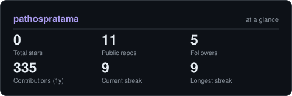
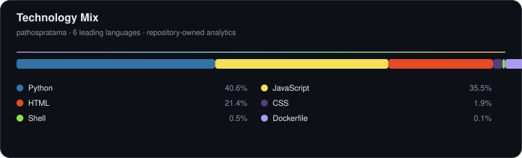

<!-- ═══════════════════════════════════════════════════════════════
     PATHOS KRATOS — GITHUB PROFILE README
     Edition : Curated v6 · Systemic · Animated · Self-Hosted · Bilingual
     Sections: hero · focus · projects · stack · signals · self-hosted
               analytics · contribution snake · system · direction · connect · footer
     Palette : #AA9BEF (lavender) · #7EE7C7 (mint) · #F5C77E (amber)
     ═══════════════════════════════════════════════════════════════ -->

  
   

  <picture>
    <source media="(prefers-color-scheme: dark)" srcset="assets/banner-dark.v9.svg">
    <source media="(prefers-color-scheme: light)" srcset="assets/banner-light.v9.svg">
    
  </picture>

    

  

    

  
  
  
  

   
  <b>🇬🇧</b> Indonesia-based · Software Engineering · Systems · AI · Interactive Technology 
  <b>🇮🇩</b> Berbasis di Indonesia · Rekayasa Perangkat Lunak · Sistem · AI · Teknologi Interaktif

 

<!-- 04 SIGNALS -->

 

<table>
<tr>
<td width="50%" align="center"><picture><source media="(prefers-color-scheme: dark)" srcset="assets/radar-dark.svg"><source media="(prefers-color-scheme: light)" srcset="assets/radar-light.svg"></picture> Engineering Skill Radar · Radar Kompetensi</td>
<td width="50%" align="center"><picture><source media="(prefers-color-scheme: dark)" srcset="assets/radar-langs-dark.svg"><source media="(prefers-color-scheme: light)" srcset="assets/radar-langs-light.svg"></picture> Technology Radar · Radar Teknologi</td>
</tr>
</table>

 

<!-- 05 SELF-HOSTED -->

 

  Repository-owned SVGs · Python generators · GitHub Actions
    
  <picture>
    <source media="(prefers-color-scheme: dark)" srcset="assets/card-stats-dark.svg">
    <source media="(prefers-color-scheme: light)" srcset="assets/card-stats-light.svg">
    
  </picture>
    
  

 

<!-- 06 ANALYTICS -->

 

  Live contribution movement · activity is treated as the system's data stream
    
  

 

  <picture>
    <source media="(prefers-color-scheme: dark)" srcset="https://raw.githubusercontent.com/pathospratama/pathospratama/output/github-contribution-snake-dark.svg">
    <source media="(prefers-color-scheme: light)" srcset="https://raw.githubusercontent.com/pathospratama/pathospratama/output/github-contribution-snake-light.svg">
    
  </picture>

 

<table>
<tr>
  <td width="25%" align="center"><code>HEAD</code> find active contribution</td>
  <td width="25%" align="center"><code>BODY</code> follow traversal path</td>
  <td width="25%" align="center"><code>BITE</code> consume active cell</td>
  <td width="25%" align="center"><code>LOOP</code> restart from the grid edge</td>
</tr>
</table>

 

<code>PATHOS // SNAKE.PROTOCOL</code> · Lavender snake · GitHub contribution colors · Dark/light aware

  <h3><code>Build · Learn · Ship · Repeat</code></h3>
  Built with code, curiosity & persistence — <b>@pathospratama</b> Dibangun dengan code, rasa ingin tahu & kegigihan — <b>@pathospratama</b>
    
  

